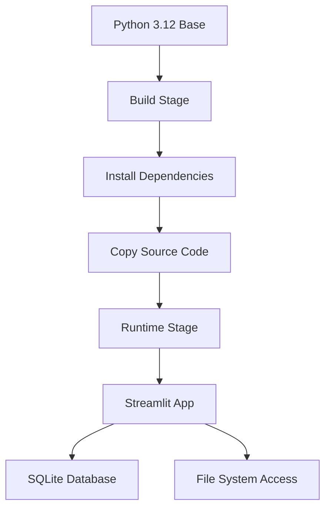

# Docker Deployment Guide for code2markdown

This guide provides comprehensive instructions for deploying the code2markdown Streamlit application using Docker containers.

## 🐳 Quick Start

### Prerequisites
- Docker Engine 20.10+
- Docker Compose 2.0+
- 4GB+ available RAM
- Internet connection for initial image pull

### One-Command Deployment
```bash
# Clone the repository
git clone https://github.com/yourusername/code2markdown.git
cd code2markdown

# Start the application
docker-compose --profile prod up -d
```

Access the application at: `http://localhost:8501`

## 📋 Docker Configuration Overview

### Multi-Stage Build Architecture


### Key Features
- **Multi-stage build** for optimized image size (~200MB vs ~800MB)
- **Non-root user** execution for enhanced security
- **Health checks** with automatic restart
- **Environment variable** configuration support
- **Volume mounting** for persistent data
- **Cross-platform** support (Linux/Windows/macOS)

## 🔧 Configuration Options

### Environment Variables
Copy `.env.example` to `.env` and customize:

```bash
# Core Configuration
ENVIRONMENT=production
STREAMLIT_SERVER_PORT=8501
STREAMLIT_SERVER_ADDRESS=0.0.0.0

# Security Settings
STREAMLIT_SERVER_ENABLECORS=false
STREAMLIT_SERVER_ENABLECSRF_PROTECTION=true

# Database
DATABASE_URL=sqlite:///app/data/code2markdown.db

# Logging
LOG_LEVEL=INFO
```

### Docker Compose Profiles
```bash
# Development mode with live code reloading
docker-compose --profile dev up -d

# Production mode with optimized settings
docker-compose --profile prod up -d

# Production with Nginx reverse proxy
docker-compose --profile prod-nginx up -d
```

## 🚀 Deployment Scenarios

### 1. Local Development
```bash
# Start development environment
docker-compose --profile dev up -d

# View logs
docker-compose logs -f app-dev

# Stop development
docker-compose --profile dev down
```

### 2. Production Deployment
```bash
# Start production environment
docker-compose --profile prod up -d

# Scale horizontally (if needed)
docker-compose --profile prod up -d --scale app-prod=3

# Stop production
docker-compose --profile prod down
```

### 3. Cloud Deployment (AWS/Azure/GCP)
```bash
# Build and push to container registry
docker build -t your-registry/code2markdown:latest .
docker push your-registry/code2markdown:latest

# Deploy using cloud-specific tools
# (See cloud-specific sections below)
```

## 🔒 Security Best Practices

### Container Security
- Runs as non-root user (`appuser`)
- Minimal base image (`python:3.12-slim`)
- No unnecessary packages in runtime
- Regular security scanning with Trivy

### Network Security
- CORS disabled by default
- CSRF protection enabled
- Configurable allowed hosts
- Health check endpoint exposed

### Data Security
- SQLite database in mounted volume
- No sensitive data in container image
- Environment variables for secrets

## 📊 Monitoring and Health Checks

### Health Check Endpoint
```bash
# Check application health
curl -f http://localhost:8501/_stcore/health

# Expected response: HTTP 200 OK
```

### Container Health
```bash
# Check container status
docker ps

# View health check logs
docker inspect <container-id> | grep Health
```

### Application Logs
```bash
# View real-time logs
docker-compose logs -f app-prod

# View specific log level
docker-compose logs app-prod | grep ERROR
```

## 🔧 Troubleshooting

### Common Issues

#### Port Already in Use
```bash
# Find process using port 8501
netstat -tulpn | grep 8501

# Use alternative port
docker-compose --profile prod up -d -p 8502:8501
```

#### Permission Denied
```bash
# Fix data directory permissions
sudo chown -R 1000:1000 ./data

# Or use Docker user mapping
export USER_ID=$(id -u)
export GROUP_ID=$(id -g)
docker-compose --profile prod up -d
```

#### Container Won't Start
```bash
# Check container logs
docker-compose logs app-prod

# Verify configuration
docker-compose config

# Rebuild without cache
docker-compose build --no-cache
```

### Performance Issues

#### High Memory Usage
```bash
# Monitor resource usage
docker stats

# Adjust memory limits
# Add to docker-compose.yml:
# deploy:
#   resources:
#     limits:
#       memory: 1G
```

#### Slow Startup
```bash
# Enable verbose logging
export VERBOSE=true
docker-compose --profile prod up -d

# Check startup time
docker-compose logs app-prod | grep "Starting"
```

## 🌐 Advanced Configuration

### Custom Streamlit Configuration
Create `streamlit_config.toml`:
```toml
[server]
port = 8501
address = "0.0.0.0"
headless = true
maxUploadSize = 200

[browser]
gatherUsageStats = false

[theme]
primaryColor = "#FF6B6B"
backgroundColor = "#FFFFFF"
secondaryBackgroundColor = "#F0F2F6"
textColor = "#262730"
```

### Reverse Proxy (Nginx)
```nginx
server {
    listen 80;
    server_name your-domain.com;
    
    location / {
        proxy_pass http://app-prod:8501;
        proxy_set_header Host $host;
        proxy_set_header X-Real-IP $remote_addr;
        proxy_set_header X-Forwarded-For $proxy_add_x_forwarded_for;
        proxy_set_header X-Forwarded-Proto $scheme;
    }
}
```

## 📁 Volume Management

### Persistent Data
```bash
# Backup data volume
docker run --rm -v code2markdown_data:/data -v $(pwd):/backup alpine tar czf /backup/data-backup.tar.gz -C /data .

# Restore data volume
docker run --rm -v code2markdown_data:/data -v $(pwd):/backup alpine tar xzf /backup/data-backup.tar.gz -C /data
```

### Database Migration
```bash
# Export SQLite database
docker exec -it code2markdown-app-prod-1 sqlite3 /app/data/code2markdown.db ".backup /app/data/backup.db"

# Import SQLite database
docker cp backup.db code2markdown-app-prod-1:/app/data/code2markdown.db
```

## 🔧 Maintenance

### Regular Updates
```bash
# Pull latest image
docker-compose pull

# Rolling update with zero downtime
docker-compose --profile prod up -d --no-deps app-prod

# Clean up old images
docker image prune -f
```

### Security Updates
```bash
# Scan for vulnerabilities
docker run --rm -v /var/run/docker.sock:/var/run/docker.sock \
    aquasec/trivy:latest image your-registry/code2markdown:latest

# Update base image
# Edit Dockerfile to use latest Python version
# Rebuild and redeploy
```

## 🚀 CI/CD Integration

### GitHub Actions
The repository includes a comprehensive GitHub Actions workflow (`.github/workflows/docker-build.yml`) that:
- Builds multi-platform images
- Runs security scans
- Deploys to staging/production
- Performs health checks

### Manual Triggering
```bash
# Trigger workflow manually
gh workflow run docker-build.yml -f environment=production
```

## 📚 Additional Resources

### Docker Commands Reference
```bash
# Build image
docker build -t code2markdown .

# Run container
docker run -d -p 8501:8501 --name code2markdown code2markdown

# Interactive shell
docker run -it --rm code2markdown /bin/bash

# View logs
docker logs -f code2markdown
```

### Useful Links
- [Docker Documentation](https://docs.docker.com/)
- [Streamlit Deployment Guide](https://docs.streamlit.io/streamlit-community-cloud/deploy-your-app)
- [Docker Compose Reference](https://docs.docker.com/compose/)

## 🤝 Support

For issues and questions:
1. Check the troubleshooting section above
2. Review container logs: `docker-compose logs`
3. Open an issue on GitHub with:
   - Docker version: `docker --version`
   - Compose version: `docker-compose --version`
   - Error logs and configuration

## 📄 License

This Docker configuration is provided under the same license as the main project.